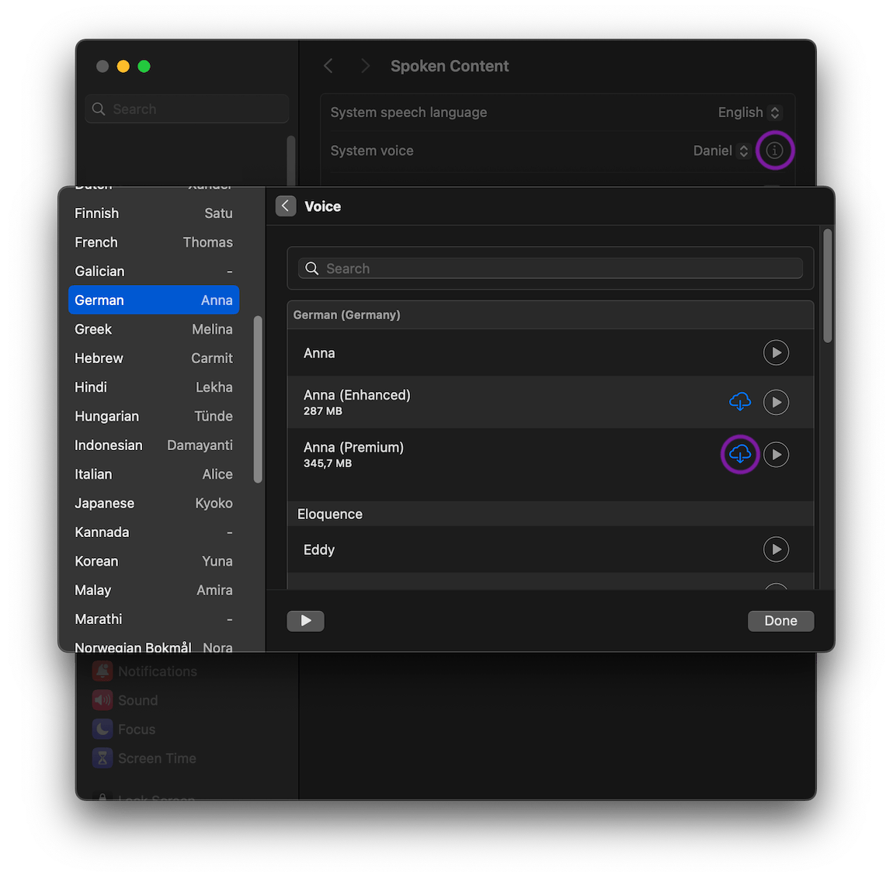

[](https://github.com/mrclmr/w2a/actions/workflows/build.yml)  [](https://goreportcard.com/report/github.com/mrclmr/w2a)

# w2a (workout to audio)

w2a converts a workout yaml file to audio files.

## Installation

See [installation](docs/installation.md).

## Example

1. Create the documented `example.yaml` file
   ```
   w2a example > example.yaml
   ```
  
2. Create sound files in `output-w2a/`
   ```
   w2a example.yaml
   ```

## Use better macOS voice

1. System Settings
2. Accessibility
3. Spoken Content
4. Click on the info symbol to the right of the selected "System voice"
5. Choose your language
6. Click the selected voice (e.g. Anna for German)
7. Click the cloud symbol to download a premium voice
   

8. See available voices
   ```
   say -v ?
   ```
9. In yaml file set `say_voice` (e.g. `say_voice: 'Anna (Premium)'`)

## Development

1. Requirements
    * [Golang latest version](https://golang.org/doc/install)
    * [golangci-lint latest version](https://github.com/golangci/golangci-lint#install-golangci-lint)
    * [just latest version](https://github.com/casey/just)

2. Execute
   ```
   just
   ```

## Sound Credits

* Race Start (start-2929965.wav) by JustInvoke -- https://freesound.org/s/446142/ -- License: Attribution 4.0
* success.wav (success-a1a69bc.wav) by maxmakessounds -- https://freesound.org/s/353546/ -- License: Attribution 4.0

## Ideas

- [ ] Generate .m3u8 playlist
- [ ] Add rounds
